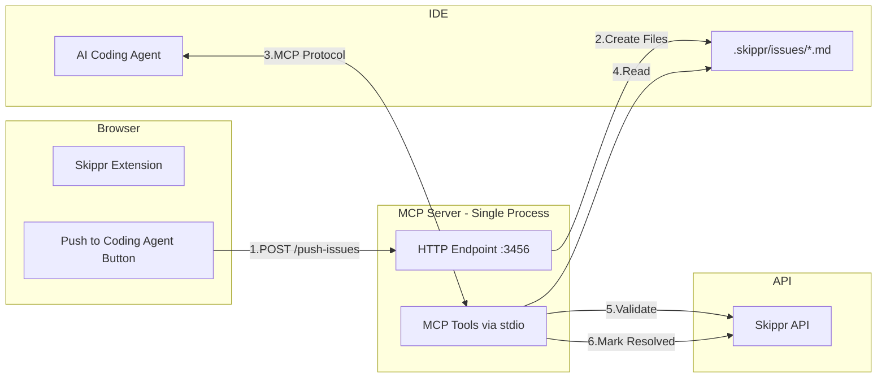

# Skippr2Code

## Overview

This document outlines the design for a Model Context Protocol (MCP) server that bridges Skippr’s product review insights with AI coding agents. The integration enables developers to push product issues directly from the Skippr browser extension to their IDE, where AI agents can automatically implement fixes.

## Problem Statement

Currently, when Skippr identifies product issues (UX, accessibility, performance, etc.), developers must manually interpret and fix each issue. This creates a disconnect between issue identification and resolution, slowing down the development cycle.

## Solution Overview

A lightweight MCP server that:
- Receives issues from the Skippr extension via HTTP
- Creates local markdown files for AI agents to access
- Provides MCP tools for issue reading, validation, and resolution
- Updates issue status in Skippr when fixes are applied

## Architecture

### Single Server, Dual Interface Pattern

Following the architecture pattern demonstrated by [BrowserMCP](https://github.com/BrowserMCP/mcp), our server implements two communication interfaces within a single Node.js process:

1. **HTTP Endpoint** (Port 3456) - Receives issue data from the Skippr extension
2. **MCP stdio Interface** - Communicates with AI coding agents (Claude, Cursor, Windsurf)

**Reference Implementation**: BrowserMCP successfully uses this pattern to handle browser automation requests from extensions while providing MCP tools to AI agents.

### System Flow



## Core Workflows

### 1. Issue Push Workflow

- User clicks “Push to Coding Agent” on an issue card in the extension
- Extension sends POST request to local MCP server (http://localhost:3456/push-issue)
- Server creates markdown file in `.skippr/reviews/{id}/issues/` directory
- Server responds with success confirmation

### 2. AI Fix Workflow

- Developer prompts AI: “Fix the Skippr issues in my project”
- AI uses `skippr_list_issues` tool to discover available issues
- AI reads issue details using `skippr_get_issue` tool
- AI implements fixes in the codebase
- AI validates fix using `skippr_validate_fix` tool
- AI marks issue as resolved using `skippr_mark_resolved` tool

### 3. Validation Workflow

- MCP server calls Skippr API to re-run specific agent check
- Compares before/after state of the issue
- Returns validation result to AI agent
- Updates issue status if validation passes

## File Structure

```
project-root/
└── .skippr/
    └── reviews/
        └── {review-id}/
            ├── metadata.json       # Review metadata
            └── issues/
                ├── issue-{id}.md   # Individual issue files
                └── ...
```

## MCP Tools Specification

### Core Tools

| Tool | Purpose | Notes |
| --- | --- | --- |
| `skippr_list_issues` | List all available issues | Returns issues from `.skippr` directory |
| `skippr_get_issue` | Get detailed issue information | Reads specific markdown file |
| `skippr_validate_fix` | Check if issue is resolved | Calls Skippr API for re-validation |
| `skippr_mark_resolved` | Mark issue as fixed | Updates status via Skippr API |

## Extension Integration

### UI/UX Changes

- Add “Push to Coding Agent” button to each issue card
- Show push status (pending/success/error)
- Display resolution status when issue is fixed

### API Requirements

- HTTP POST endpoint at `localhost:3456/push-issue`
- CORS enabled for browser extension
- No authentication required (local-only communication)

### Compatibility

- Claude Desktop (via claude_desktop_config.json)
- Cursor IDE (via settings.json)
- Windsurf IDE (MCP compatible)
- Any MCP-compatible AI coding assistant

## References

- [BrowserMCP Architecture](https://github.com/BrowserMCP/mcp) - Example of dual-interface MCP server
- [Model Context Protocol Specification](https://modelcontextprotocol.io/)
- [MCP TypeScript SDK](https://github.com/modelcontextprotocol/typescript-sdk)

## Appendix: Configuration Examples

### Claude Desktop Configuration

Users will add the Skippr MCP server to their Claude Desktop configuration file, pointing to their project directory as the working directory.

### Issue Markdown Structure

Standard markdown format with frontmatter for metadata, ensuring AI agents can easily parse and understand issue context.

---

*Note: This document describes a simplified PoC implementation. Production deployment would require additional considerations for security, scalability, and error handling.*